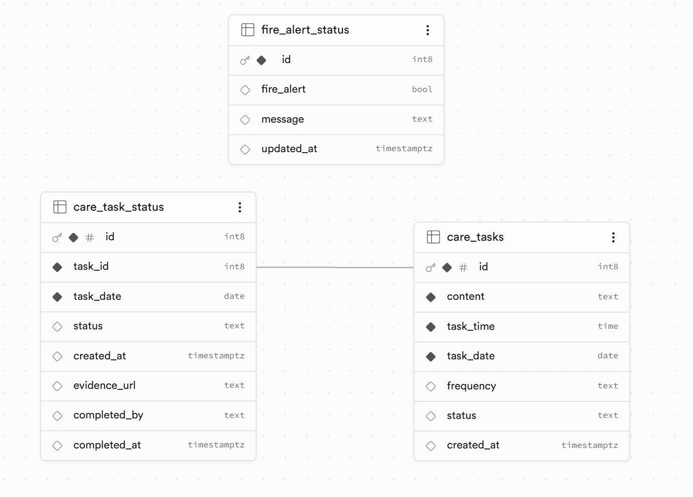

````md
# AR Dementia Care Prototype

A proof-of-concept assistive system designed to reduce caregiver supervision requirements for dementia patients through computer vision–based task monitoring and remote caregiver alerts.

The system uses YOLOv8 object detection to identify task completion events (e.g., drinking water or breakfast preparation) and a custom-trained fire detection model to trigger caregiver alerts in real time.

## Features

- Real-time object detection using YOLOv8
- Fire detection with persistent alert logic
- Evidence image capture for completed tasks
- Remote caregiver monitoring through Supabase
- Live camera feed streaming
- Task completion logging with image evidence

## Demo Tasks

### 1. Drink Water Task
- Detects a water bottle
- Captures evidence image
- Marks hydration task as completed

### 2. Breakfast Task
- Detects both:
  - Apple
  - Cup
- Captures evidence image
- Marks breakfast task as completed

### 3. Fire Safety Monitoring
- Detects visible flames using a custom YOLOv8 model
- Sends persistent caregiver alerts
- Prevents alert flickering using a hold timer

## Technology Stack

- Python
- Flask
- OpenCV
- YOLOv8 (Ultralytics)
- Supabase
- Flask-CORS

## Project Structure

```txt
project-root/
│── app.py
│── requirements.txt
│── yolov8n.pt
│── evidence/
│── models/
│   └── flame_exp1/
│       └── flame_yolov8n_30ep/
│           └── weights/
│               └── best.pt
│── assets/
│   └── database_schema.png
````

## Database Structure

The system uses Supabase to manage care tasks, caregiver alerts, and evidence tracking.



## Setup

### 1. Install dependencies

```bash
pip install -r requirements.txt
```

### 2. Configure Supabase

Replace the placeholders in `app.py`:

```python
SUPABASE_URL = "YOUR_SUPABASE_URL"
SUPABASE_KEY = "YOUR_SUPABASE_KEY"
SUPABASE_BUCKET = "task-evidence"
```

Create a storage bucket named:

```txt
task-evidence
```

### 3. Run the server

```bash
python app.py
```

## Endpoints

| Endpoint               | Description           |
| ---------------------- | --------------------- |
| `/`                    | API status            |
| `/video`               | Live camera stream    |
| `/alert-status`        | Fire alert state      |
| `/evidence/<filename>` | Evidence image access |

## Notes

This repository contains a proof-of-concept prototype developed for an Engineering Technology Innovation Project (ETIP). The system is intended for demonstration and research purposes only.


